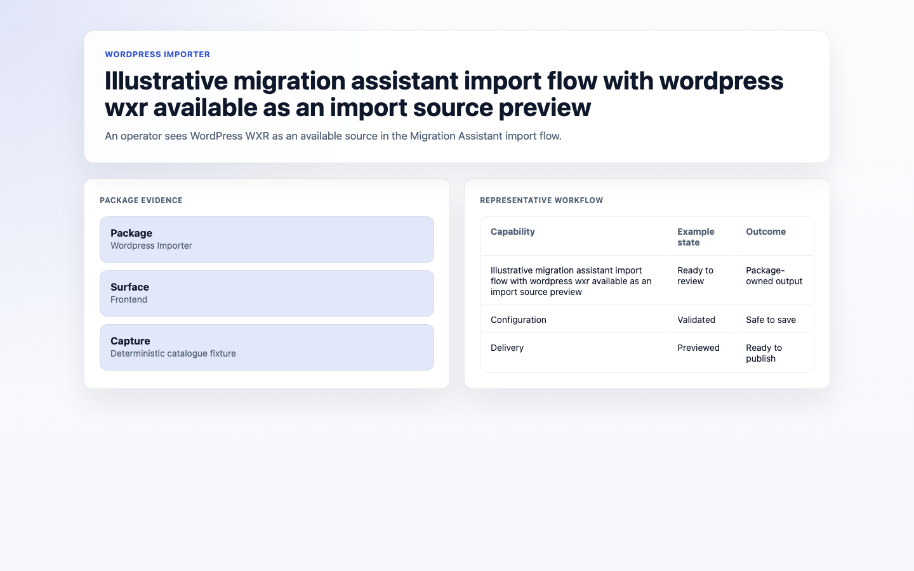
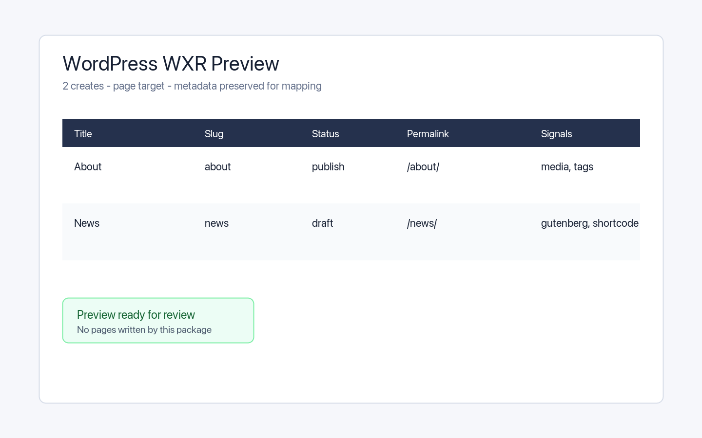
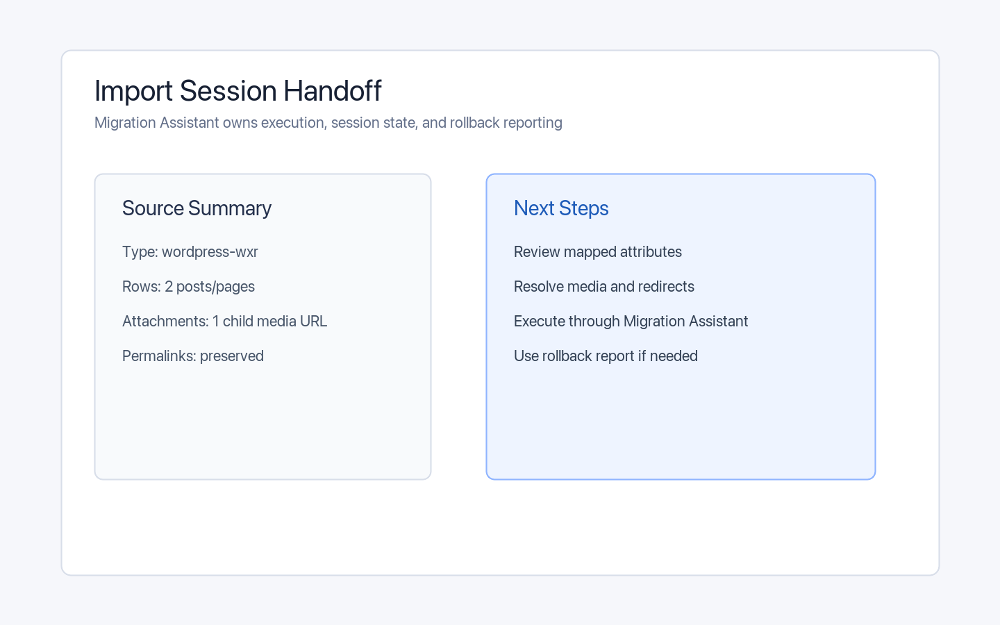

# Using WordPress Importer

This guide is for editors moving a site from WordPress and owners planning the migration. Every step uses the labels you see on screen. WordPress Importer runs inside Migration Assistant, so install that first.

## Using WordPress Importer (editor how-to)

### How to connect a WordPress export

1. Export your content from WordPress (a WordPress export file).
2. In **Migration Assistant**, start a new import and choose **WordPress** as the source.
3. Provide your WordPress export.

### How to match categories and fields

1. In the import, open the mapping step.
2. Match old WordPress categories to your Capell ones.
3. Match the post fields (title, body, date) to Capell fields.
4. Save the mapping.

### How to import posts and media

1. Preview the import to check the result. The preview lists the parsed posts and pages with their title, slug, status, date, categories, tags, and author.
2. Run the import to bring across posts, pages, and media.

### How to verify the import

1. Open the **Results**.
2. Confirm posts and pages came across, and spot-check a few on the site.
3. Check that images appear; re-import any that were skipped.
4. Open the import session that Migration Assistant created to review the full record of what was imported.

## Rolling out WordPress Importer (for owners)

### Turn on first

- **Migration Assistant, then a test import.** Install Migration Assistant, back up, and import a few posts before bringing everything across.

### Add when needed

| Need                          | Enable                                      |
| ----------------------------- | ------------------------------------------- |
| Move an entire WordPress site | A full import once a test batch looks right |
| Keep your old structure       | Careful category mapping before running     |

### Don't enable yet

- Don't run the full import until a small test batch and its media verify correctly.

### Who does what

| Role       | First useful screen                             |
| ---------- | ----------------------------------------------- |
| Editor     | The WordPress import in **Migration Assistant** |
| Site owner | **Results**: confirm the migration is complete  |

## Troubleshooting for editors

| What you see                         | What it means                                       | What to do                                                     |
| ------------------------------------ | --------------------------------------------------- | -------------------------------------------------------------- |
| WordPress isn't offered as a source  | Migration Assistant or the importer isn't installed | Install Migration Assistant first, then the WordPress Importer |
| Categories landed in the wrong place | The category mapping was off                        | Fix the mapping and re-run                                     |
| Images are missing                   | Media wasn't included or mapped                     | Confirm media is part of the export and re-import              |
| Some posts didn't import             | They were skipped due to errors                     | Review **Results** and re-import the affected posts            |
